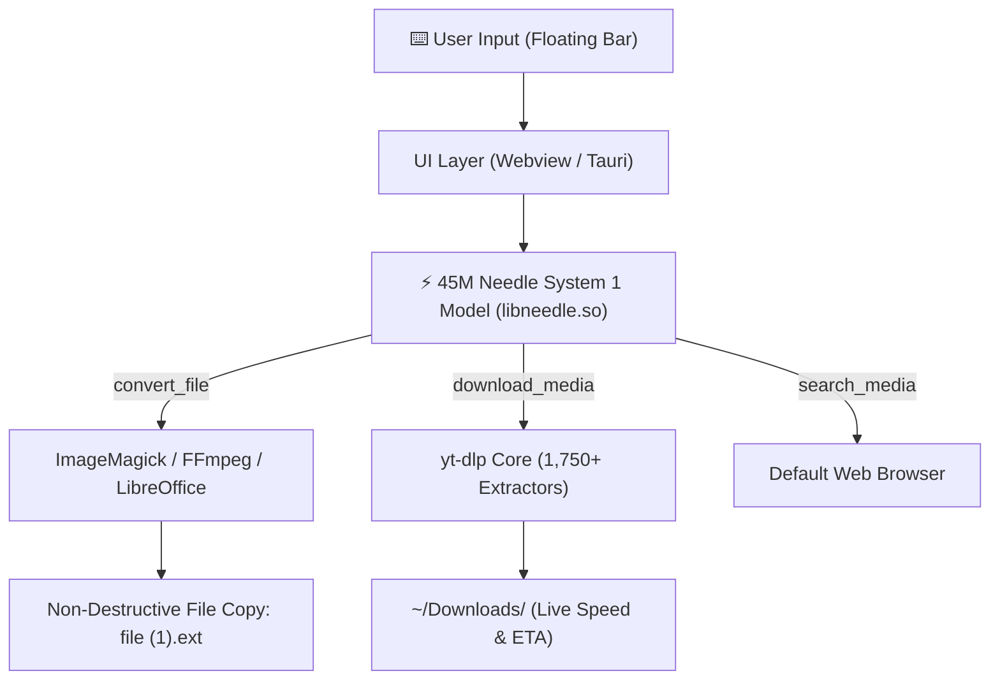

# ⚡ needle-ry1

> **The Zero-Latency, 29 MB On-Device Desktop Command Palette.**  
> Powered by an embedded 45M parameter neural reflex engine. Zero cloud telemetry. Zero subscriptions. 100% private.

---

## 🚀 Quickstart

### 1. Pre-Built Binaries (Cross-Platform)
Download ready-to-run releases from the [Releases Page](../../releases):
* **Linux**: Standalone `.AppImage` & `.deb`
* **Windows**: Portable `.exe` & `.msi`
* **macOS**: Universal `.dmg` (Apple Silicon & Intel)

### 2. Run from Source (Python Desktop Launcher)
```bash
git clone https://github.com/Rythamo8055/needle-ry1.git
cd needle-ry1
pip install -r python/requirements.txt
python3 python/ry1_app.py
```

### 3. Native Tauri App
```bash
npm install
npm run tauri dev
```

---

## ⚡ The Manifesto: How Existing Systems Break

Modern desktop AI assistants have lost their way, split into two flawed extremes:

```
                    ┌────────────────────────────────────────────────────────┐
                    │            The Desktop AI Landscape Today              │
                    └───────────────────────────┬────────────────────────────┘
                                                │
                ┌───────────────────────────────┴───────────────────────────────┐
                ▼                                                               ▼
   ❌ 1. The Cloud AI Assistants                                    ❌ 2. Local Heavyweights
      (Copilot, Raycast AI, Gemini Desktop)                             (Ollama 8B, LM Studio, Llama 3)
      • Latency: 500ms – 1,800ms API lag                                • Footprint: 8 GB – 16 GB RAM hog
      • Privacy: Transmits every keystroke to cloud                     • Battery: Drains laptop battery in 45 mins
      • Economics: $20/month subscription traps                         • Storage: 5 GB – 10 GB weights per model
      • Fragility: 100% broken offline on airplanes                     • Execution: Slow prompt prefill on CPU
```

### 🏆 Why `needle-ry1` Wins

`needle-ry1` rejects the bloat. It treats desktop actions not as a chat conversation, but as an **instant, deterministic reflex layer (System 1 cognition)**:

| Feature / Metric | Cloud AI (Copilot / Raycast) | Local 8B (Ollama / Llama 3) | ⚡ **needle-ry1** |
| :--- | :--- | :--- | :--- |
| **RAM Consumption** | ~350 MB (Electron wrapper) | **8,000 MB – 16,000 MB** | **`29 MB` (500× lighter)** |
| **Idle CPU Load** | 1% – 5% background tracking | 5% – 15% model standby | **`0.0%` (Zero battery drain)** |
| **Latency** | 600ms – 1,500ms (Network ping) | 3,000ms – 10,000ms (CPU) | **`< 800 ms` (Local CPU)** |
| **Internet Dependency**| **Mandatory** (Broke offline) | Offline | **100% Offline Capable** |
| **Privacy / Telemetry**| Keystrokes sent to servers | Local | **Zero cloud calls, Zero logs** |
| **System Superpowers**| Limited to text completion | Text only (needs MCP glue) | **Native OS tool execution** |
| **File Safety** | Often overwrites silently | N/A | **Non-destructive copies only** |

---

## 🛠️ Core Capabilities

### 1. Safe, Non-Destructive File Conversion (`convert_file`)
Directly integrates with `ImageMagick`, `FFmpeg`, and `LibreOffice` for local file transformations.
* **Safety Policy**: Your original file is **never deleted or overwritten**. If the target filename exists, it safely writes `file (1).ext`.
* **Path-Aware**: Handles long Linux/macOS/Windows paths with spaces, timestamps, and quotes:
  ```
  "/home/user/Pictures/Screenshots/Screenshot 2026-09-22.png" to jpeg
  convert quarterly_budget.docx to pdf
  turn voice_memo.wav into mp3
  ```

### 2. Live Media Streaming & Downloads (`download_media`)
Leverages an embedded `yt-dlp` core supporting **1,750+ extractors**:
* **Direct URLs**: YouTube, Instagram Reels, TikTok, Twitter/X, Twitch, SoundCloud, Vimeo, and more.
* **Search & Download by Title**:
  ```
  download song named interstellar theme from youtube
  ```
* **Real-Time Progress Streaming**: Displays download percentage, speed (MB/s), and ETA directly inside the floating bar.

### 3. Instant Media & Video Search (`search_media`)
* Fast browser previews on typing.
* Hit `Enter` to immediately launch the matched media in your default web browser.

---

## 🔍 Where We Fail: Honest Limitations & Trade-Offs

We believe in complete transparency about model capabilities and constraints:

1. **Not a Conversational Brain (No World Knowledge)**:
   * At **45 million parameters**, the neural model cannot answer history trivia, compose poetry, explain quantum mechanics, or write software code.
   * If you ask *"who won the 2022 World Cup"*, it will either refuse or pass the keywords to web search.
2. **Strict Schema Dependency**:
   * The model is a **specialized function-calling reflex engine**. It maps user intent strictly to declared tools (`convert_file`, `download_media`, `search_media`). Unrelated tasks outside this scope are rejected.
3. **No Multi-Step Reasoning**:
   * It cannot execute chains like *"find the top 5 videos by artist X, download the third one, and convert only the last 30 seconds to wav"*. It operates on direct, single-step commands.

---

## 🎯 Who Is This Built For?

* **Developers & Power Users**: Want a lightning-fast command bar that does what it's told in 20 milliseconds without spinning up an 8 GB Docker container.
* **Privacy Advocates & Air-Gapped Workstations**: Environments where zero data can leave the local machine.
* **Resource-Constrained & Portable Hardware**:
  * Ultra-light laptops & ThinkPads on battery power
  * Steam Deck & handheld Linux gaming consoles
  * Raspberry Pi 4 / 5 and local ARM SBCs

---

## 🏗️ Architecture



---

## 📄 License

Licensed under the [Apache License 2.0](LICENSE). Free for personal and commercial use.
